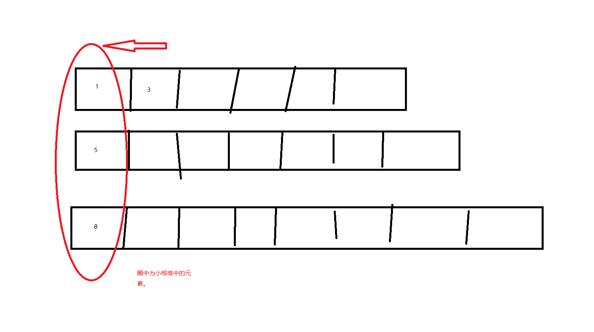

# 题目：合并K个升序链表


> 给你一个链表数组，每个链表都已经按升序排列。
>
> 请你将所有链表合并到一个升序链表中，返回合并后的链表。
>
>  
>
> **示例 1：**
>
> ```
> 输入：lists = [[1,4,5],[1,3,4],[2,6]]
> 输出：[1,1,2,3,4,4,5,6]
> 解释：链表数组如下：
> [
>   1->4->5,
>   1->3->4,
>   2->6
> ]
> 将它们合并到一个有序链表中得到。
> 1->1->2->3->4->4->5->6
> ```
>
> **示例 2：**
>
> ```
> 输入：lists = []
> 输出：[]
> ```
>
> **示例 3：**
>
> ```
> 输入：lists = [[]]
> 输出：[]
> ```
>
>  
>
> **提示：**
>
> - `k == lists.length`
> - `0 <= k <= 10^4`
> - `0 <= lists[i].length <= 500`
> - `-10^4 <= lists[i][j] <= 10^4`
> - `lists[i]` 按 **升序** 排列
> - `lists[i].length` 的总和不超过 `10^4`


# 题解：归并排序

看到这个题目我们很容易联想到归并排序，将一个无序的数组进行不断的拆分，然后对两个数进行比较排序，组成一个有序列表。

归并排序参考：https://www.cnblogs.com/chengxiao/p/6194356.html


而这个题目我们开一把一个个的有序列表类比成一个数，同样的进行分治，也可以将这些有序列表看做已经拆分好了，在合并过程中的中间产物,只需要进行相关的合并即可。

代码：

```java
 //思路1 归并排序
    private ListNode solution1(ListNode[] lists) {
        if (lists == null || lists.length == 0) {
            return null;
        }
        if (lists.length == 1) {
            return lists[0];
        }
        List<ListNode> listNodes = Arrays.asList(lists);

        while (listNodes.size() > 1) {
            int length = listNodes.size();
            List<ListNode> tempListNodes = new ArrayList<>();
            for (int i = 0; i < listNodes.size(); i++) {
                ListNode listNode1 = listNodes.get(i);
                ListNode listNode2 = i + 1 == length ? null : listNodes.get(i+1);
                i++;
                tempListNodes.add(mergeTwoList(listNode1, listNode2));
            }
            listNodes = tempListNodes;
        }
        return listNodes.get(0);

    }


    private ListNode mergeTwoList(ListNode listNode1, ListNode listNode2) {
        ListNode head = new ListNode(), tail = head;
        while (listNode1 != null && listNode2 != null) {
            if (listNode1.val <= listNode2.val) {
                tail.next = listNode1;
                tail = listNode1;
                listNode1 = listNode1.next;
            } else {
                tail.next = listNode2;
                tail = listNode2;
                listNode2 = listNode2.next;
            }
        }
        tail.next = listNode1 == null ? listNode2 : listNode1;
        return head.next;
    }
```

# 题解：小根堆

小根堆的思路也非常简单，通过维护一个小根堆，每次取出最小的一个元素，加入到有序链表。在取出元素后如果当前链表还有下一个元素，链表head后移。



代码：

```java
//思路二小根堆
    private ListNode solution2(ListNode[] lists){
        if (lists == null || lists.length == 0) {
            return null;
        }
        if (lists.length == 1) {
            return lists[0];
        }
        PriorityQueue<ListNode> queue = new PriorityQueue<ListNode>(new Comparator<ListNode>() {
            @Override
            public int compare(ListNode o1, ListNode o2) {
                return o1.val-o2.val;
            }
        });
        ListNode head = new ListNode();
        ListNode tail = head;
        for (ListNode list : lists) {//初始化小根堆
            if (list != null) {
                queue.add(list);
            }
        }
        while (queue.size() != 0){
            ListNode listNode = queue.poll();
            tail.next = listNode;
            tail = listNode;
            if(listNode.next != null){//
                queue.add(listNode.next);
            }
        }
        return head.next;
    }
```

