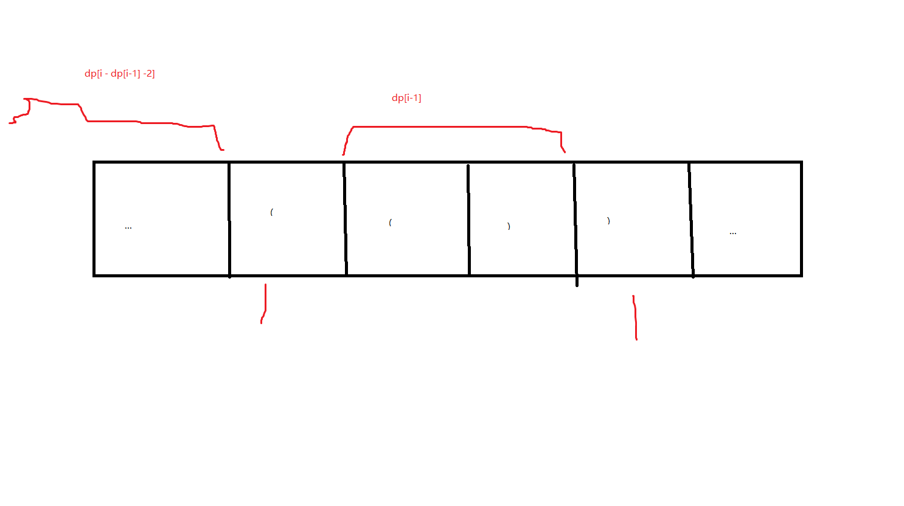

# 题目：最长有效括号

> 给你一个只包含 '(' 和 ')' 的字符串，找出最长有效（格式正确且连续）括号子串的长度。
>
>  
>
> 示例 1：
>
> 输入：s = "(()"
> 输出：2
> 解释：最长有效括号子串是 "()"
> 示例 2：
>
> 输入：s = ")()())"
> 输出：4
> 解释：最长有效括号子串是 "()()"
> 示例 3：
>
> 输入：s = ""
> 输出：0
>
>
> 提示：
>
> 0 <= s.length <= 3 * 104
> s[i] 为 '(' 或 ')'


# 题目分析：

看到这个题目我们可以发现该题与 第5题最长回文子串类似。https://juejin.cn/post/6969029763629318157   在最长回文子串中有三种思路，暴力求解；动态规划，中心扩展。在这个题目可以使用的有哪些方法呢？

暴力求解因为时间复杂度较高。我们暂时不选择这个方法。

## 动态规划求解

还记得动态规划三要素吗？

- 边界条件
- 状态转移方程
- 最优子结构

我们定义数组dp[i] 表示以下表i字符结尾的最长有效括号的长度。显然当字符以 ‘(’ 结尾时，dp[i] = 0; dp[0] = 0;

当以 ')' 字符结尾时，如果要dp[i] != 0 那么前面必定有一个字符 '(' 与之匹配。并且该字符 '(' 与最后一个字符 ')' 之间包含的内容应该是有效的括号（如果包含的内容是无效的，那么最后一个字符是不能构成有效的括号的）。

即：满足 第 i -  dp[i -1]  - 1 是字符 ' ( '  那么  dp[i] != 0 成立

那么 dp[i] = dp[ i   - 1] + dp[i - dp[i-1] -2] + 2 



代码：

```java
 private int solution2(String s){
        if (s == null || s.length() < 2) {
            return 0;
        }
        int l = s.length();
        int max = 0;
        int[] dp = new int[s.length()];
        for (int i=1;i<l;i++){
            if (s.charAt(i) == ')') {
                if (i - dp[i - 1] > 0 && s.charAt(i - dp[i - 1] - 1) == '(') {//  ))
                    dp[i] = dp[i - 1] + ((i - dp[i - 1]) >= 2 ? dp[i - dp[i - 1] - 2] : 0) + 2;
                }
                max = Math.max(max, dp[i]);
            }
        }
        return max;
    }
```

## 利用栈求解

当遇到 '(' 时入栈，栈中保存的是字符的坐标，当遇到 ')' 出栈  此时坐标与栈中元素的坐标相减+1就是 以该右括号为结尾的最长有效括号的长度。但是直接这样做会有一个问题，无法处理 （（））这个类型的字符串，因为没办法标记起始坐标。因此官方的做法是：

> 对于遇到的每个 ‘(’ ，我们将它的下标放入栈中
> 对于遇到的每个 ‘)’ ，我们先弹出栈顶元素表示匹配了当前右括号：
> 如果栈为空，说明当前的右括号为没有被匹配的右括号，我们将其下标放入栈中来更新我们之前提到的「最后一个没有被匹配的右括号的下标」
> 如果栈不为空，当前右括号的下标减去栈顶元素即为「以该右括号为结尾的最长有效括号的长度」
> 我们从前往后遍历字符串并更新答案即可。
>
> 需要注意的是，如果一开始栈为空，第一个字符为左括号的时候我们会将其放入栈中，这样就不满足提及的「最后一个没有被匹配的右括号的下标」，为了保持统一，我们在一开始的时候往栈中放入一个值为 -1 的元素。
>

官方代码：

```java
 private int solution3(String s){
        int max = 0;
        Deque<Integer> stack = new LinkedList<Integer>();
        stack.push(-1);
        for (int i = 0; i < s.length(); i++) {
            if (s.charAt(i) == '(') {
                stack.push(i);
            } else {
                stack.pop();
                if (stack.isEmpty()) {
                    stack.push(i);
                } else {
                    max = Math.max(max, i - stack.peek());
                }
            }
        }
        return max;
    }
```

