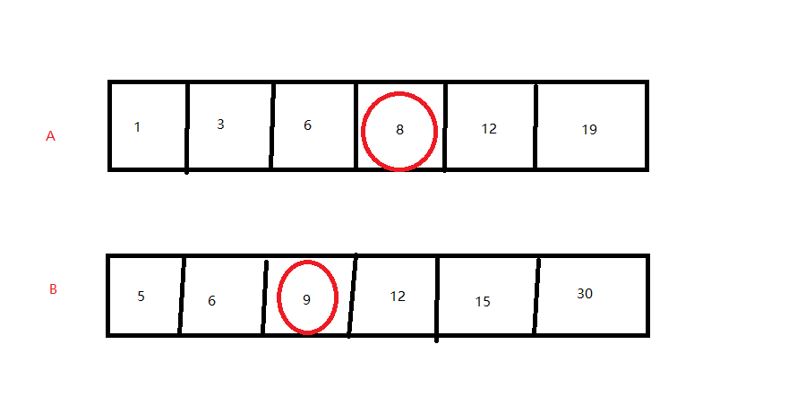
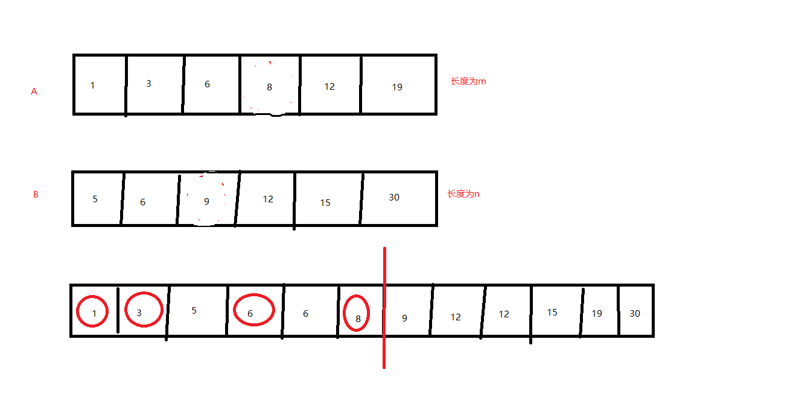

这是我参与更文挑战的第1天，活动详情查看： [更文挑战](https://juejin.cn/post/6967194882926444557)

# LeetCode刷题笔记4寻找两个正序数组的中位数

正好最近时间比较充分，打算花一定的时间来刷leetcode题目，并进行一定的总结。正好掘金进行更文挑战赛。立个flag-我的目标是本月进行18篇leetcode刷题笔记，并且6月不刷抖音，不看直播。

好了开始本篇的笔记总结：

笔记重点：更加容易理解官方划分数组方法

地址：https://leetcode-cn.com/problems/median-of-two-sorted-arrays/

题目描述：

> 给定两个大小分别为 m 和 n 的正序（从小到大）数组 nums1 和 nums2。请你找出并返回这两个正序数组的 中位数 。
>
>  
>
> 示例 1：
>
> 输入：nums1 = [1,3], nums2 = [2]
> 输出：2.00000
> 解释：合并数组 = [1,2,3] ，中位数 2
> 示例 2：
>
> 输入：nums1 = [1,2], nums2 = [3,4]
> 输出：2.50000
> 解释：合并数组 = [1,2,3,4] ，中位数 (2 + 3) / 2 = 2.5
> 示例 3：
>
> 输入：nums1 = [0,0], nums2 = [0,0]
> 输出：0.00000
> 示例 4：
>
> 输入：nums1 = [], nums2 = [1]
> 输出：1.00000
> 示例 5：
>
> 输入：nums1 = [2], nums2 = []
> 输出：2.00000
>
>
> 提示：
>
> nums1.length == m
> nums2.length == n
> 0 <= m <= 1000
> 0 <= n <= 1000
> 1 <= m + n <= 2000
> -106 <= nums1[i], nums2[i] <= 106
>
>
> 进阶：你能设计一个时间复杂度为 O(log (m+n)) 的算法解决此问题吗？

## 自我题解

思路1：直接合并两个数组，如果总长度为奇数那么就是中间那一个，如果偶数那么就是中间哪两个的平局值。

思路2：因为两个数组都是有序的，我们每次减去一个最大值和最小值，这样当剩下的数小于等于2的时候，就是中位数。


因为都有序，那么最大值和最小值一定在两个数组的两端产生。

示例代码：

```java
 public double solution1(int[] nums1, int[] nums2) {
        int leftStart = 0, leftEnd = nums1.length - 1, rightStart = 0, rightEnd = nums2.length - 1;
        int leftL = leftEnd - leftStart + 1;
        int rightL = rightEnd - rightStart + 1;
        if (rightL == 0 && leftL == rightL) {
            return 0;
        }
        while (leftL + rightL > 2) {
            if (leftStart > leftEnd) {//左侧已经没有可供选择的数
                rightStart++;
                rightEnd--;
            } else if (rightStart > rightEnd) {//右侧没有可供选择的数
                leftStart++;
                leftEnd--;
            } else {
                if (nums1[leftStart] < nums2[rightStart]) {
                    leftStart++;
                } else {
                    rightStart++;
                }
                if (nums1[leftEnd] > nums2[rightEnd]) {
                    leftEnd--;
                } else {
                    rightEnd--;
                }
            }
            leftL = leftEnd - leftStart + 1;
            rightL = rightEnd - rightStart + 1;
        }
        if (leftL == 0) {
            return (nums2[rightStart] + nums2[rightEnd]) / 2.0;
        } else if (rightL == 0) {
            return (nums1[leftStart] + nums1[leftEnd]) / 2.0;
        } else {
            return (nums1[leftStart] + nums2[rightStart]) / 2.0;
        }
    }
```

可以看到我们自己的方案虽然能够获取正确值，但是其时间复杂度为o(m+n),m n 分别为两个数组长度。

题目想要时间复杂度为 O(log (m+n)) 的算法,该如何做呢？

## 官方题解：二分查找法

因为两个数组都是有序，并且长度已知，假设我们将两个数组合并成一个有序数组，那么我们可以直接根据合并后数组的下标来确定中位数。假设 两个数组长度分别为  m n; k = (m+n)/2。官方的二分查找法就是在不合并数组的情况下，利用二分法来确定第k个元素原来数组上的位置。因为m n k 全部都是已知数，题目就转化成了，**求两个有序数组合并后的第k个位置的数是哪一个**。

我们比较前A B  数组第 k/2 -1 个数 ，对于其中最小的数，连同自身共有k/2个数必定小于第k个元素。



从上面的数组中我们可以知道中位数是第6个和第7个数的平均数，假设我们要求第6个数，我们只需要排除前面5个数，剩下的最小的一个就是第6个数。

以上面的数据为例：

k = 6 ； K/2-1 = 2 比较 A[2] =6; B[2] = 9、A[2] 小，即A[0]、A[1]、A[2] 都比第K个元素小。一共要排除(k-1) = 5个元素已经排除了三个  k = k - 3 = 3。此时**A数组的起始位置是3**

k=3，   K/2-1 = 0；A[0+3] = 8、 B[0] = 5,B[0] 小，同理，排除B[0] k的总数减去1 k = k - 1 = 2  此时**B数组的起始位置是1**

k = 2,   K/2-1 = 0;   A[0+3] = 8 、B[0+1] = 6  B[1] 小  ，排除B[1]  k = k - 1 = 1  此时排除的总数 = 3+1+1 = k-1  **B数组的起始位置是2** 

比较A[3]  B[2]    A[3] 小，即第6个数是A[3] = 8

leetCode官方代码：

```java
public double findMedianSortedArrays(int[] nums1, int[] nums2) {
        int length1 = nums1.length, length2 = nums2.length;
        int totalLength = length1 + length2;
        if (totalLength % 2 == 1) {
            int midIndex = totalLength / 2;
            double median = getKthElement(nums1, nums2, midIndex + 1);
            return median;
        } else {
            int midIndex1 = totalLength / 2 - 1, midIndex2 = totalLength / 2;
            double median = (getKthElement(nums1, nums2, midIndex1 + 1) + getKthElement(nums1, nums2, midIndex2 + 1)) / 2.0;
            return median;
        }
    }

    public int getKthElement(int[] nums1, int[] nums2, int k) {
        /* 主要思路：要找到第 k (k>1) 小的元素，那么就取 pivot1 = nums1[k/2-1] 和 pivot2 = nums2[k/2-1] 进行比较
         * 这里的 "/" 表示整除
         * nums1 中小于等于 pivot1 的元素有 nums1[0 .. k/2-2] 共计 k/2-1 个
         * nums2 中小于等于 pivot2 的元素有 nums2[0 .. k/2-2] 共计 k/2-1 个
         * 取 pivot = min(pivot1, pivot2)，两个数组中小于等于 pivot 的元素共计不会超过 (k/2-1) + (k/2-1) <= k-2 个
         * 这样 pivot 本身最大也只能是第 k-1 小的元素
         * 如果 pivot = pivot1，那么 nums1[0 .. k/2-1] 都不可能是第 k 小的元素。把这些元素全部 "删除"，剩下的作为新的 nums1 数组
         * 如果 pivot = pivot2，那么 nums2[0 .. k/2-1] 都不可能是第 k 小的元素。把这些元素全部 "删除"，剩下的作为新的 nums2 数组
         * 由于我们 "删除" 了一些元素（这些元素都比第 k 小的元素要小），因此需要修改 k 的值，减去删除的数的个数
         */

        int length1 = nums1.length, length2 = nums2.length;
        int index1 = 0, index2 = 0;
        int kthElement = 0;

        while (true) {
            // 边界情况
            if (index1 == length1) {
                return nums2[index2 + k - 1];
            }
            if (index2 == length2) {
                return nums1[index1 + k - 1];
            }
            if (k == 1) {
                return Math.min(nums1[index1], nums2[index2]);
            }
            
            // 正常情况
            int half = k / 2;
            int newIndex1 = Math.min(index1 + half, length1) - 1;
            int newIndex2 = Math.min(index2 + half, length2) - 1;
            int pivot1 = nums1[newIndex1], pivot2 = nums2[newIndex2];
            if (pivot1 <= pivot2) {
                k -= (newIndex1 - index1 + 1);
                index1 = newIndex1 + 1;
            } else {
                k -= (newIndex2 - index2 + 1);
                index2 = newIndex2 + 1;
            }
        }
    }
```


## 官方题解：划分数组

相比较与二分查找，划分数组的官方题解确实有一定的理解难度。我这里不打算按照官方题解来解释这个问题。希望能够更加容易理解这个方法。

假设我们将两个数组合并成一个有序数组，并且按照下面的规则划分，

**当总是是奇数，左侧的长度比右侧多1  ，当总数是偶数 左右两侧长度相等**   即奇数时，中位数是左侧的最大值，偶数时是左侧最大值与右侧最小值的平均数。



在合并后的数组中，前（m+n）/2中的数如果有 i  个来自数组A那么剩余的 j = m+n）/2 - i个必然来自n。

举例说明：（m+n）/2 = 6

当 i = 0 时 j = 6 即前6个全部来自B数组，左侧最大值为B[5] = 30  > 右侧最小值A[0] = 1 不能构成有序数组， 不符合

当 i = 1 时 j = 5 左侧最大值是 A[0]  B[4] 中的较大值；B4=[15]  > 右侧最小值A[1] = 3 (B[5] = 30 > A[1])  不能构成有序数组， 不符合

当 i = 2 时 j = 4  左侧最大值为B[3] = 12  右侧最小值是 A[2] = 6  不符合

当 i = 3 时 j = 3 左侧最大值是 B[2] = 9 右侧最小值是 A[3] = 8  不符合

当 i = 4 时 j = 2 左侧最大致是 A[3] = 8 右侧最小值是 B[2] = 9 符合  因为 两个数组总长度是偶数 中位数是 (左侧最大 + 右侧最小)  / 2 .0= (8 + 9) /2.0 = 8.5 

 明显的此时的时间复杂度为O(m)  不符合  `O(log (m+n))` 的算法。

采用二分查找法来进行处理，以数组长度较小的作为定准。为什么不能以较大的呢？假设m = 20 n = 2;因为二分查找,  i 的取值范围是[0,20],k = (m+2)/2 = 11 如果i取大于11的数那么j就只能取负数，明显是不合理的。因此需要用较小长度的数组作为定准。

既然采用二分法来查找i的取值，那么什么时候 这个范围向上，什么时候范围向下呢？

我们继续补全上面案例中的数据

i = 5 时 j = 1 左侧最大数 A[4] = 12  右侧最小数为 B[1] = 6  不符合

i = 6 时 j = 0 左侧最大数 A[5] = 19 右侧最小数B[0] = 1   不符合

可以发现，**当A[i] <= B[j-1]的时候 i 还可以增加。否则只能减小。**

数组AB都有序，i 减小，j会增加，如果此时再去减小i 那么A[i] <= B[j-1]会永远为true,只有增加I减小j。

这样我们就能理解官方的数组划分的方法了。

官方参考代码：

```java
public double findMedianSortedArrays(int[] nums1, int[] nums2) {
        if (nums1.length > nums2.length) {
            return findMedianSortedArrays(nums2, nums1);
        }

        int m = nums1.length;
        int n = nums2.length;
        int left = 0, right = m;
        // median1：前一部分的最大值
        // median2：后一部分的最小值
        int median1 = 0, median2 = 0;

        while (left <= right) {
            // 前一部分包含 nums1[0 .. i-1] 和 nums2[0 .. j-1]
            // 后一部分包含 nums1[i .. m-1] 和 nums2[j .. n-1]
            int i = (left + right) / 2;
            int j = (m + n + 1) / 2 - i;

            // nums_im1, nums_i, nums_jm1, nums_j 分别表示 nums1[i-1], nums1[i], nums2[j-1], nums2[j]
            int nums_im1 = (i == 0 ? Integer.MIN_VALUE : nums1[i - 1]);
            int nums_i = (i == m ? Integer.MAX_VALUE : nums1[i]);
            int nums_jm1 = (j == 0 ? Integer.MIN_VALUE : nums2[j - 1]);
            int nums_j = (j == n ? Integer.MAX_VALUE : nums2[j]);

            if (nums_im1 <= nums_j) {
                median1 = Math.max(nums_im1, nums_jm1);
                median2 = Math.min(nums_i, nums_j);
                left = i + 1;
            } else {
                right = i - 1;
            }
        }

        return (m + n) % 2 == 0 ? (median1 + median2) / 2.0 : median1;
    }
```

总代码参考地址：

https://github.com/xiaolutang/androidTool/blob/master/leetcode/src/main/java/com/txl/leetcode/top100/Solution4.java