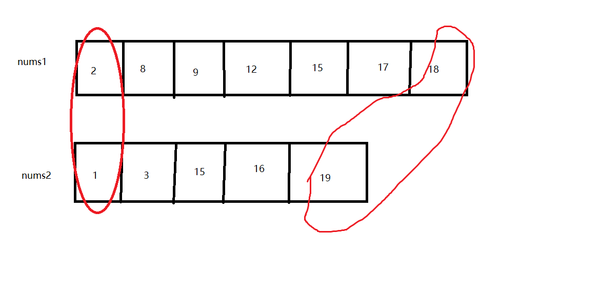

这是我参与更文挑战的第1天，活动详情查看： [更文挑战](https://juejin.cn/post/6967194882926444557)

# LeetCode刷题笔记4寻找两个正序数组的中位数

正好最近时间比较充分，打算花一定的时间来刷leetcode题目，并进行一定的总结。正好掘金进行更文挑战赛。立个flag-我的目标是本月进行18篇leetcode刷题笔记。

好了开始本篇的笔记总结：

地址：https://leetcode-cn.com/problems/median-of-two-sorted-arrays/

题目描述：

> 给定两个大小分别为 m 和 n 的正序（从小到大）数组 nums1 和 nums2。请你找出并返回这两个正序数组的 中位数 。
>
>  
>
> 示例 1：
>
> 输入：nums1 = [1,3], nums2 = [2]
> 输出：2.00000
> 解释：合并数组 = [1,2,3] ，中位数 2
> 示例 2：
>
> 输入：nums1 = [1,2], nums2 = [3,4]
> 输出：2.50000
> 解释：合并数组 = [1,2,3,4] ，中位数 (2 + 3) / 2 = 2.5
> 示例 3：
>
> 输入：nums1 = [0,0], nums2 = [0,0]
> 输出：0.00000
> 示例 4：
>
> 输入：nums1 = [], nums2 = [1]
> 输出：1.00000
> 示例 5：
>
> 输入：nums1 = [2], nums2 = []
> 输出：2.00000
>
>
> 提示：
>
> nums1.length == m
> nums2.length == n
> 0 <= m <= 1000
> 0 <= n <= 1000
> 1 <= m + n <= 2000
> -106 <= nums1[i], nums2[i] <= 106
>
>
> 进阶：你能设计一个时间复杂度为 O(log (m+n)) 的算法解决此问题吗？
>

## 自我题解

思路1：直接合并两个数组，如果总长度为奇数那么就是中间那一个，如果偶数那么就是中间哪两个的平局值。

思路2：因为两个数组都是有序的，我们每次减去一个最大值和最小值，这样当剩下的数小于等于2的时候，就是中位数。



因为都有序，那么最大值和最小值一定在两个数组的两端产生。

示例代码：

```java
 public double solution1(int[] nums1, int[] nums2) {
        int leftStart = 0, leftEnd = nums1.length - 1, rightStart = 0, rightEnd = nums2.length - 1;
        int leftL = leftEnd - leftStart + 1;
        int rightL = rightEnd - rightStart + 1;
        if (rightL == 0 && leftL == rightL) {
            return 0;
        }
        while (leftL + rightL > 2) {
            if (leftStart > leftEnd) {//左侧已经没有可供选择的数
                rightStart++;
                rightEnd--;
            } else if (rightStart > rightEnd) {//右侧没有可供选择的数
                leftStart++;
                leftEnd--;
            } else {
                if (nums1[leftStart] < nums2[rightStart]) {
                    leftStart++;
                } else {
                    rightStart++;
                }
                if (nums1[leftEnd] > nums2[rightEnd]) {
                    leftEnd--;
                } else {
                    rightEnd--;
                }
            }
            leftL = leftEnd - leftStart + 1;
            rightL = rightEnd - rightStart + 1;
        }
        if (leftL == 0) {
            return (nums2[rightStart] + nums2[rightEnd]) / 2.0;
        } else if (rightL == 0) {
            return (nums1[leftStart] + nums1[leftEnd]) / 2.0;
        } else {
            return (nums1[leftStart] + nums2[rightStart]) / 2.0;
        }
    }
```

可以看到我们自己的方案虽然能够获取正确值，但是其时间复杂度为o(m+n),m n 分别为两个数组长度。

题目想要时间复杂度为 O(log (m+n)) 的算法,该如何做呢？

## 官方题解：二分查找法

因为两个数组都是有序，并且长度已知，假设我们将两个数组合并成一个有序数组，那么我们可以直接根据合并后数组的下标来确定中位数。假设 两个数组长度分别为  m n; k = (m+n)/2。官方的二分查找法就是在不合并数组的情况下，利用二分法来确定第k个元素原来数组上的位置。

## 官方题解：划分数组