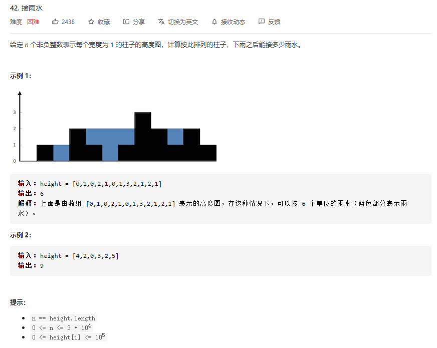
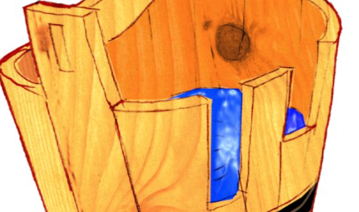

# 题目：接雨水

题解：

下表i位置能够装多少水取决于它左边和右边最大值中较小的一个（一个木桶能够装多少水，取决于最低的边）。具体的是 较小的值与当前高度的差值。

这样问题就转化成了查找位置i的左侧最大值和右侧最大值的问题。

那么该如何求取对应的最大值呢？

- 每个位置分别向左向右扫描查找最大值。
- 使用动态规划思想，先求出每个位置对应的值。

第一种思路的时间复杂度为O(n^2)，第二种为 O(n)