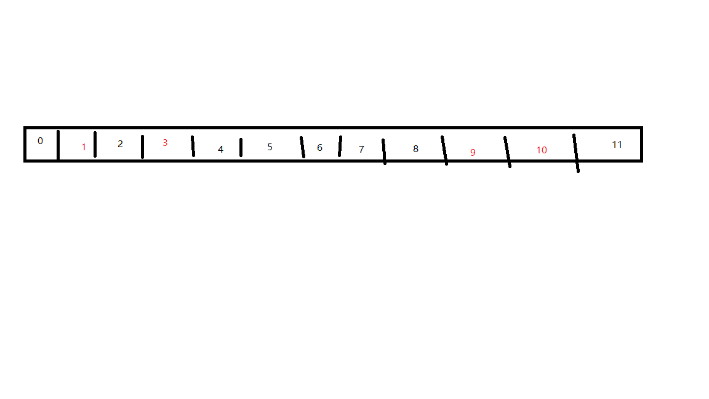

# leetcode刷题笔记之-710黑名单中的随机数------我终于弄懂了官方解题思路。


地址：https://leetcode-cn.com/problems/random-pick-with-blacklist/

## 题目描述：

> 给定一个包含 [0，n) 中不重复整数的黑名单 blacklist ，写一个函数从 [0, n) 中返回一个不在 blacklist 中的随机整数。
>
> 对它进行优化使其尽量少调用系统方法 Math.random() 。
>
> 提示:
>
> 1 <= n <= 1000000000
> 0 <= blacklist.length < min(100000, N)
> [0, n) 不包含 n ，详细参见 interval notation 。
> 示例 1：
>
> 输入：
> ["Solution","pick","pick","pick"]
> [[1,[]],[],[],[]]
> 输出：[null,0,0,0]
> 示例 2：
>
> 输入：
> ["Solution","pick","pick","pick"]
> [[2,[]],[],[],[]]
> 输出：[null,1,1,1]
> 示例 3：
>
> 输入：
> ["Solution","pick","pick","pick"]
> [[3,[1]],[],[],[]]
> 输出：[null,0,0,2]
> 示例 4：
>
> 输入： 
> ["Solution","pick","pick","pick"]
> [[4,[2]],[],[],[]]
> 输出：[null,1,3,1]
> 输入语法说明：
>
> 输入是两个列表：调用成员函数名和调用的参数。Solution的构造函数有两个参数，n 和黑名单 blacklist。pick 没有参数，输入参数是一个列表，即使参数为空，也会输入一个 [] 空列表

## 题目解析：

题目的意思还是非常明确，但是在看到示例的时候却让人感觉莫不这头脑：这里在简单说明一下。

输入： 
["Solution","pick","pick","pick"] 
[[4,[2]],[],[],[]]
输出：[null,1,3,1]
 **解释：意思是会调用一次 Solution 构造函数 三次pick函数；调用 Solution 构造函数时长度的参数是 4，[2];调用pick时未传参数。**

# 官方三种解题方法解析

说实话我在拿到题目的时候只能想到第一种解题方法，不知道你们能想到那些呢？

## 解题方法1：维护白名单 

> 如果我们有了白名单（即黑名单之外的所有整数），那么我们就可以在白名单中随机选取整数并返回了。
>
> 我们首先在集合中放入 [0, N) 中的所有整数，随后移除所有在黑名单中出现过的数，并把剩下的数放入列表中，就得到了白名单。

leetcode官方代码：

```java
class Solution {

    List<Integer> w;
    Random r;

    public Solution(int n, int[] b) {
        w = new ArrayList<>();
        r = new Random();
        Set<Integer> W = new HashSet<>();
        //现将所有数据加入到白名单中
        for (int i = 0; i < n; i++) W.add(i);
        //将黑名单中的数移除
        for (int x : b) W.remove(x);
        //构建真正的白名单
        w.addAll(W);
    }

    public int pick() {
        return w.get(r.nextInt(w.size()));
    }
}
```

## 解题方法2：二分查找法

官方题解：


问题：

1. 为什么 mid = (lo + hi + 1) / 2   而不是   mid = (lo + hi ) / 2
2. c = B[mid] - mid 表示 在总名单上 黑名单前面可以插入的白名单数量（总名单可以理解成[0,n)的列表）。为什么c是和k比较
3. 为什么二分法查找结束之后会出现官方的现象

带着上面的问题我们来尝试自己写二分查找。

**理解 c = B[mid] - mid   在总名单T 上  T[mid] = mid 就像官方图上一样  B[1] = 2; 2-1 = 1 即B[1] 前可以插入一个白名单数**

我们知道在这个位置二分查找结束的标志是lo==hi  即二分查找的高低位相等，那么我们怎么确定第K个白名单数是落在总名单上B[lo]的左侧还是右侧呢？


### 第k个白名单数据的计算方式


1.在条件可能的情况下 k落在黑名单左侧，特殊情况黑名单的最大数都比第k个白名单小  

注意下下面的话可能不是太好理解：  第h黑名单前能个插入白名单总数 preCountW 个，在总名单上第h个黑名单数的左侧第一个就是第 preCountW -1 个白名单数，那么第k个白名单就是第h个黑名单的值 -  (preCountW - k ) ;如果处于特殊情况  那么 第k个白名单 = 第h个黑名单的值 + k - preCountW 

代码如下：

```java
 /**
     *
     * k在总名单上落在 h的左侧
     * */
    private int pick2fenLeft(int k) {
        System.out.println("pick2fen start   "+k);
        if (blacklistLength == 0) {
            return k;
        }
        int l = 0, h = blacklist.length - 1;
        while (l != h) {
            int mid = (l + h) / 2;
            //blacklist[mid]-mid 的含义是 当前黑名单中的数据 - 黑名单顺序数  = 当前位置之前可以插入的白名单个数
            int preCountW = blacklist[mid] - mid;
            if (preCountW >= k+1) {//第k个实际有k+1个数  mid 是包含的
                h = mid;//因为 此时blacklist[mid]前肯定包含 k+1个白名单，但是不能确定 blacklist[mid-1]的情况，因此h不能减少
            } else {
                l = mid+1;//向上抬，放在左侧
            }
        }

        int preCountW = blacklist[h] - h;
        System.out.println("pick2fen end       l = " + l + " h= " + h+"  preCountW ="+preCountW +" k = "+k);
        if (preCountW >= k+1) {//落在左侧
            //在h之前共有白名单的个数
            // preCountW -(k+1) 为当前位置距离第k个空白元素的间距  那么第k个的位置在哪里呢？k的坐标从0开始
            // 第k个到 第preCountW-1个的间距是 preCountW-1 -k ;总间距是 preCountW -k;
            // blacklist[h] - preCountW +k =h + preCountW - preCountW + k
            return  h+k;
        } else {
            //h + preCountW + (k - preCountW)
            return h+k+1;
        }
    }
```


2.条件可能的情况下k落在黑名单右侧，特殊情况黑名单的最小数都比第k个白名单大

```java
/**
     *
     * k在总名单上落在 h的右侧
     * */
    private int pick2fen(int k) {
        System.out.println("pick2fen start   "+k);
        if (blacklistLength == 0) {
            return k;
        }
        int l = 0, h = blacklist.length - 1;
        while (l != h) {
            int mid = (l + h+1) / 2;
            //blacklist[mid]-mid 的含义是 当前黑名单中的数据 - 黑名单顺序数  = 当前位置之前可以插入的白名单个数
            try {
                int preCountW = blacklist[mid] - mid;
                if (preCountW >= k+1) {//第k个实际有k+1个数  mid 是包含的  此时k在黑名单mid的左侧
                    h = mid-1;//向下减放在右侧
                } else {
                    l = mid;
                }
            }catch (Exception r){
                System.out.println("mid is "+mid);
                throw r;
            }
        }

        int preCountW = blacklist[h] - h;
        System.out.println("pick2fen end       l = " + l + " h= " + h+"  preCountW ="+preCountW +" k = "+k);
        if (preCountW >= k+1) {//preCountW >= k+1 保证落在第h个黑名单数的左侧
            // 黑名单左侧第一个是第 preCountW -1 个白名单  其值 =  blacklist[h]-1
            // 第k个白名单 = blacklist[h]-1 - （preCountW -1 - k） = h + preCountW - 1 - preCountW + 1 + k = h + k;
            return   k+h;//此时 h = 0
        } else {//此时最大的黑名单数也比白名单小。那么第k个白名单 = 黑名单数的总个数+k +1 （因为k和黑名单总数h都是从0开始，所以要加1）
            return h+k+1;
        }
    }
```

可以看到不论我们默认选取k落在黑名单的左侧还是右侧，他们的最终返回值都是一样的。

**特别注意：**l=mid+1的时候 默认k落在黑名单左侧；h = mid - 1的时候k落在黑名单右侧。但是这两种情况下mid的起算方式却是不一样的他们不能互换。

## 解题方法3：黑名单映射

黑名单映射相对二分查找理解起来非常简单：总长度为n 白名单长度为wl 黑名单长度为bl; wl + bl = n;我们可以有下面的结论：**在总名单上前wl个数中有m个黑名单数（m<=wl）那么在后[wl,n)必有m个白名单数**



leetcode官方代码：

```java
class Solution {

    Map<Integer, Integer> m;
    Random r;
    int wlen;

    public Solution(int n, int[] b) {
        m = new HashMap<>();
        r = new Random();
        wlen = n - b.length;
        Set<Integer> w = new HashSet<>();
        //注意这里是从wlen开始的
        for (int i = wlen; i < n; i++) w.add(i);
        for (int x : b) w.remove(x);
        Iterator<Integer> wi = w.iterator();
        for (int x : b)
            if (x < wlen)
                m.put(x, wi.next());
    }

    public int pick() {
        int k = r.nextInt(wlen);
        return m.getOrDefault(k, k);
    }
}
```

代码参考地址：https://github.com/xiaolutang/androidTool/blob/master/leetcode/src/main/java/com/txl/leetcode/sort/Solution710.java
