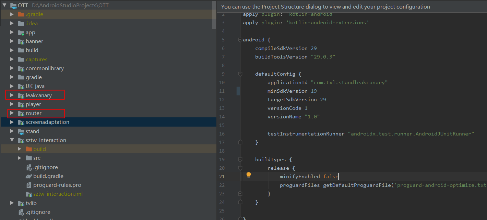
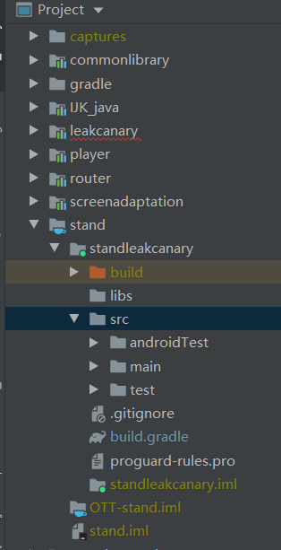
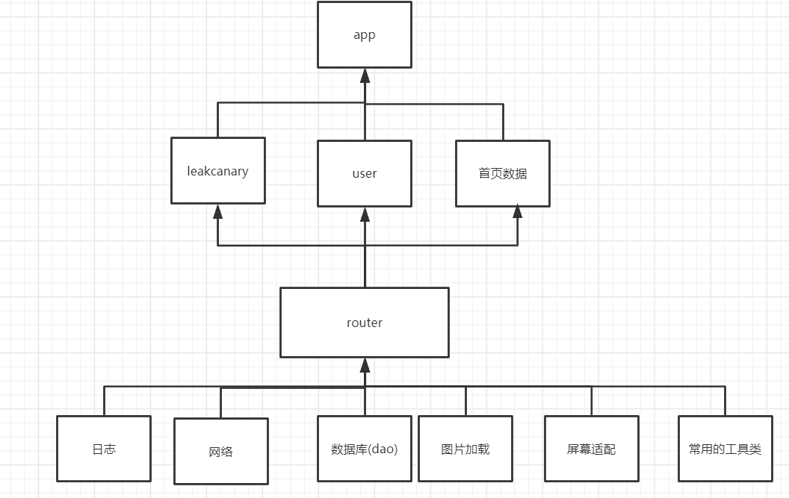

技术参考：

https://juejin.im/post/5b5f17976fb9a04fa775658d#heading-1

https://juejin.im/post/5bb9c0d55188255c7566e1e2#heading-6

# app工厂现存问题。

1. 项目编译时间长
2. 业务模块之间的关系比较复杂，难以短时间内进行清理
3. 每一次改动，都需要对整个项目进行编译 。
4. 无法做到功能复用
5. 业务模块间耦合严重

# 为什么要实行组件化？

1. 组件可以进行单独的模块编译。有利于效率的提高
2. 有利于功能复用
3. 解决业务模块之间的耦合问题。

# app工厂组件化可能会遇到的问题。

1. 不可能集中大片的时间来进行组件化重构
2. 业务模块的依赖关系不够清楚
3. 组件化方案的选择？组件之间如何通信？
4. 组件化的成本在团队业务迭代的过程中是否可控，可接受。

# app工厂组件化 方案的选择

- 我们希望组件化的过程不要有太大学习成本
- 对现有模块可以实行逐步组件化，新加的模块可以完全组件化。

个人理解  [AppJoint](https://github.com/PrototypeZ/AppJoint)这个框架相对而言比较适合 App工厂的组件化过程改造。


AppJoint框架优势：

框架学习简单，上手成本低。

框架的替换成本低，在一定层度上甚至可以全部 自己实现框架的逻辑。

# ott项目组件化测试

在ott中引入LeakCanary,以便排查项目中是否存在内存泄漏的问题。

我么新建一个模块：leakcanary。这个模块需要有一下能力

- 方便其它项目使用
- 在测试版中能够使用，在正式版排除

于是将这个模块组件化。下面是具体的操作过程

## 1.新建leakcanary和router模块



leakcanary：是一个单独的组件，它不依赖其他模块 

router:作为一个基础模块，提供组件之间通信的基础接口。同时其他的组件模块需要依赖它。

## 2.在router模块定义leakcanary对外暴露的能力

```kotlin
interface ILeakCanaryRouter {
    /**
     * Watches the provided [watchedObject].
     *
     * @param description Describes why the object is watched.
     */
    fun watch(watchedObject: Any, description: String)
}
```

这个接口对外提供检测某个内存对象是否泄漏。

3.在leakcanary模块实现ILeakCanaryRouter接口

```kotlin
@ServiceProvider
class LeakCanaryRouterImpl:ILeakCanaryRouter {
    @Synchronized
    override fun watch(watchedObject: Any, description: String) {
        AppWatcher.objectWatcher.watch(watchedObject, description)
    }
}
```

这个位置通过AppJoint的@ServiceProvider注解实现他们之间的绑定关系 。

## 3.独立测试leakcanary的功能

新建standleakcanary模块




## 4.在App模块使用

```kotlin
//这里检测这个fragment对象内存是否被正常 回收
val appRouter = AppJoint.service(ILeakCanaryRouter::class.java)
appRouter.watch(lastFragment!!,"fragment test collect")
```

# leakcanary模块不实行组件化与组件化的对比

主要是组件化之后：

组件化模块具有单独编译的能力 ，方便我们 进行单独的测验。

代码复用性强，方便多个项目共用

组件化后的架构图：

