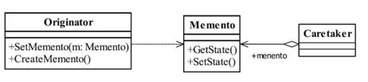

# 备忘录模式

**介绍：**备忘录模式是一种行为模式，该模式用于保存对象当前状态，并且在之后可以再次恢复到此状态。

**定义：**在不破坏封闭的前提下，捕获一个对象的内部状态，并在该对象之外保存这个状态，这样以后就可以将该对象恢复到原先保存的状态。

**uml图：**



Originator:负责创建一个备忘录，可以记录，恢复自身的内部状态。同时Originator还可以根据需要决定Memento存储自身那些内部状态。

Memento:备忘录角色，用于存储Originator的内部状态，并且可以防止Originator以外的对象访问Memento。

Caretaker:负责存储备忘录，不能对备忘的内容进行操作和访问，只能将备忘记录传递给其它对象。

**简单示例：**坦克大战游戏进度保存

```java
public class TankGame {
    /**
     * 关卡
     * */
    private int mLevel = 1;
    /**
     * 生命数
     * */
    private int mLife = 5;
    /**
     * 武器
     * */
    private String mWeapon = "普通枪";

    public void play(){
        System.out.println( String.format( "坦克大战进行中 ： 第%d关,你还有%d条性命,您的武器是%s",mLevel ,mLife,mWeapon) );
        System.out.println( "捡到坦克生命值加1" );
        mLife++;
        System.out.println( "捡到武器，武器净化" );
        mWeapon = "超级武器";
        System.out.println( "过关" );
        mLevel++;
    }

    public void quite(){
        System.out.println( "----------------开始退出-------------------" );
        System.out.println( "当前进度"+this.toString() );
        System.out.println( "----------------退出完成-------------------" );
    }

    public Memoto createMemoto(){
        Memoto memoto = new Memoto();
        memoto.mLevel = mLevel;
        memoto.mLife = mLife;
        memoto.mWeapon = mWeapon;
        return memoto;
    }

    public void restore(Memoto memoto){
        mLevel = memoto.mLevel;
        mLife = memoto.mLife;
        mWeapon = memoto.mWeapon;
        System.out.println( "恢复游戏 "+this.toString() );
    }

    @Override
    public String toString() {
        return "TankGame{" +
                "mLevel=" + mLevel +
                ", mLife=" + mLife +
                ", mWeapon='" + mWeapon + '\'' +
                '}';
    }
}
```

```java
class Memoto {
    /**
     * 关卡
     * */
    public int mLevel = 1;
    /**
     * 生命数
     * */
    public int mLife = 5;
    /**
     * 武器
     * */
    public String mWeapon = "普通枪";
}
```

```java
public class Caretaker {
    Memoto memoto;

    public void archive(Memoto memoto){
        this.memoto = memoto;
    }

    public Memoto getMemoto(){
        return memoto;
    }
}
```

```java
public class Client {
    public static void main(String[] args){
        TankGame tankGame = new TankGame();
        tankGame.play();

        Caretaker caretaker = new Caretaker();
        //保存数据
        caretaker.archive( tankGame.createMemoto() );
        tankGame.quite();
        TankGame newTankGame = new TankGame();
        newTankGame.restore( caretaker.getMemoto() );

    }
}
```

