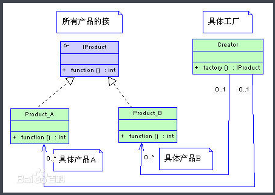

# 工厂方法模式

**定义：**定义一个用具创建接口的对象，让子类决定实例化那个类。

**使用场景：**在任何需要生成复杂对象的地方，都可以使用工厂方法模式。复杂对象适合使用工厂模式，用new就可以完成的对象无需使用工厂模式

**uml**




以汽的创建为例：

```java
public interface ICar {
    <T extends Car> T createCar(Class<T> car) ;
}
```

```java
public abstract class Car {
    /**
     * 创建车身
     * */
    abstract void createBody();

    abstract void createWheel();
}
```

```java
public class BCCar extends Car {
    @Override
    void createBody() {
        System.out.println( "创建BC车身" );
    }

    @Override
    void createWheel() {
        System.out.println( "创建BC车轮" );
    }
}
```

```java
public class BWMCar extends Car {
    @Override
    void createBody() {
        System.out.println( "创建BWM车身" );
    }

    @Override
    void createWheel() {
        System.out.println( "创建BWM车轮" );
    }
}
```

```java
public class CarFactory implements ICar{

    @Override
    public <T extends Car> T createCar(Class<T> car) {
        Car c =  null;
        try {
            c = car.newInstance();
        } catch (InstantiationException e) {
            e.printStackTrace();
        } catch (IllegalAccessException e) {
            e.printStackTrace();
        }
        return (T) c;
    }
}
```

```java
public class Test {
    public static void main(String[] args){
        ICar factory = new CarFactory();
        Car car1 = factory.createCar( BCCar.class );
        car1.createWheel();
        car1.createBody();

        Car car2 = factory.createCar( BWMCar.class );
        car2.createWheel();
        car2.createBody();
    }
}
```

