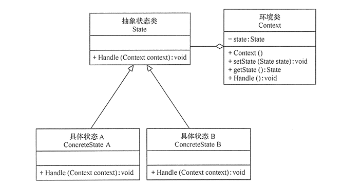

# 状态模式

**定义：**当一个对象的内在状态改变时允许其行为改变，这个对象看起来像是改变了其类。

**使用场景：**

1. 当一个对象的行为取决于它的状态，并且它必须在运行时根据状态改变它的行为。
2. 代码中包含大量与对象状态有关的语句

**解决的问题：**

1. 当控制的一个对象状态转换的条件表达式过于复杂时的情况。把状态的判断逻辑转移到表示不同状态的一系列类当中，可以把复杂的判断逻辑简化。
2. 消除庞大的条件分支
3. 通过把各种状态转移逻辑分布到state的子类之间，来减少互相之间的依赖

状态模式基本结构图：



在开发者我们最常见的就是用户登录，在用户已经登录和未登录的情况下对同一事件的处理是不一样的。例如在我的项目中，在用户未登录的情况下应该先登录在评论，如果是已经登录那么就直接进行评论。类似的还有收藏，购买等等一系列的场景。

在每一个函数中都会出现下列情况：

```
if(已经登录){
    XX行为
}else{
    执行登录
}
```

我们使用状态模式来处理这个问题：

```java
interface IUserState{
    void comment();
}
```

```java
public class LoginState implements IUserState {
    @Override
    public void comment() {
        System.out.println("评论成功");
    }
}
```

```java
public class LogoutState implements IUserState {
    @Override
    public void comment() {
        System.out.println("进行登录，在评论");
    }
}
```

```java
public class UserStateContext {
    private static UserStateContext userStateContext;
    private IUserState mState;

    private UserStateContext(){

    }

    public static UserStateContext getUserStateContext(){
        if(userStateContext == null){
            userStateContext = new UserStateContext();
            userStateContext.mState = new LogoutState();
        }
        return userStateContext;
    }

    public static UserStateContext getUserStateContext(IUserState userState){
        userStateContext = getUserStateContext();
        userStateContext.mState = userState;
        return userStateContext;
    }

    public void setmState(IUserState mState) {
        this.mState = mState;
    }

    public IUserState getmState() {
        return mState;
    }
}
```

```java
public class Main {
    public static void main(String[] args){
        UserStateContext userStateContext = UserStateContext.getUserStateContext();
        userStateContext.getmState().comment();
        userStateContext.setmState(new LoginState());
        userStateContext.getmState().comment();
    }
}
```

