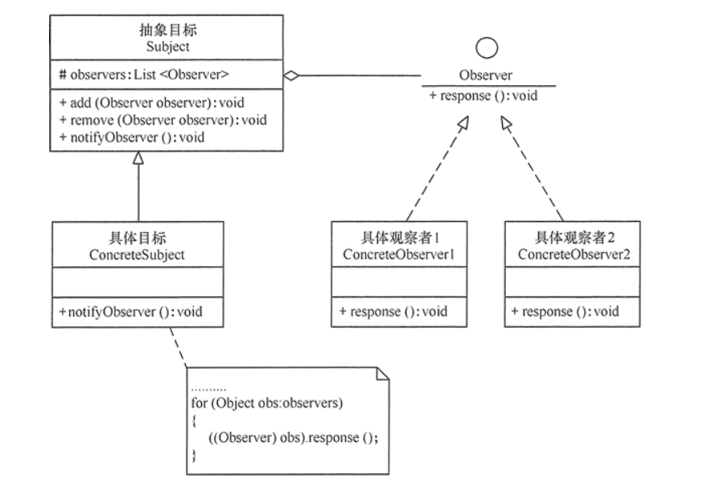

# 观察者模式

## 基本概念：

当对象间存在一对多关系时，则使用观察者模式（Observer Pattern）。比如，当一个对象被修改时，则会自动通知它的依赖对象。观察者模式属于行为型模式。

## 使用场景：

一个对象的改变将导致其他一个或多个对象也发生改变，而不知道具体有多少对象将发生改变，可以降低对象之间的耦合度。

## 结构图：



## 举例：

粗心的小明在外旅游，比较关心明天是否会下雨。但是总是忘记查看第二天的天气情况导致在下雨的时候自己的旅游计划被打乱。他想天气预报局反映了这个问题。天气预报局告诉他可以订阅他们的通知，在预计会下雨的时候会及时通知他这样就不用每天去看天气预报啦。

接下啦我们来实现简单的天气预报订阅通知：

定义通用的被观察者：

```java
import java.util.ArrayList;

public abstract class Observable<T> {

    protected final ArrayList<T> mObservers = new ArrayList<T>();

    public void registerObserver(T observer) {
        if (observer == null) {
            throw new IllegalArgumentException("The observer is null.");
        }
        synchronized(mObservers) {
            if (mObservers.contains(observer)) {
                throw new IllegalStateException("Observer " + observer + " is already registered.");
            }
            mObservers.add(observer);
        }
    }


    public void unregisterObserver(T observer) {
        if (observer == null) {
            throw new IllegalArgumentException("The observer is null.");
        }
        synchronized(mObservers) {
            int index = mObservers.indexOf(observer);
            if (index == -1) {
                throw new IllegalStateException("Observer " + observer + " was not registered.");
            }
            mObservers.remove(index);
        }
    }


    public void unregisterAll() {
        synchronized(mObservers) {
            mObservers.clear();
        }
    }
}
```

定义天气被观察者继承通用的被观察者：

```java
public class WeatherObservable extends Observable<IWeatherObserver>{
    void notifyXiaYu(){
        for (IWeatherObserver iWeatherObserver: mObservers){
            iWeatherObserver.xiaYuLa();
        }
    }
}
```

定义天气观察者接口：

```java
public interface IWeatherObserver {
    void xiaYuLa();
}
```

具体的实现：

```java
public class Main {

    public static void main(String[] args){
        Person xiaoM = new Person("小明"){
            @Override
            public void xiaYuLa() {
                super.xiaYuLa();
                System.out.println(name+" 下雨了，明天出去旅游记得带雨伞");
            }
        };

        WeatherObservable weatherObservable = new WeatherObservable();
        weatherObservable.registerObserver(xiaoM);

        //天气预报局通知下雨
        weatherObservable.notifyXiaYu();

    }
}

class Person implements IWeatherObserver{
    public Person(String name) {
        this.name = name;
    }

    String name;

    @Override
    public void xiaYuLa() {

    }
}
```

这样简单的观察者模式就实现啦。