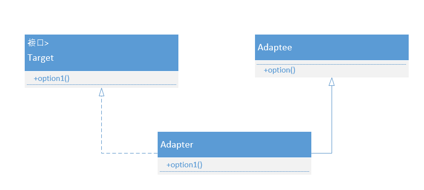
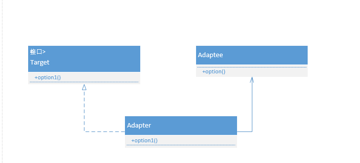

# 适配器模式

## 定义：

将一个接口转换成客户希望的另一个接口，使接口不兼容的那些类可以一起工作，其别名为包装器(Wrapper)。适配器模式既可以作为类结构型模式，也可以作为对象结构型模式。适配器模式（Adapter Pattern）是作为两个不兼容的接口之间的桥梁。这种类型的设计模式属于结构型模式，它结合了两个独立接口的功能。

## 分类

根据适配器类与适配者类的关系不同，适配器模式可分为对象适配器和类适配器两种，在**对象适配器模式**中，适配器与适配者之间是**关联**关系；在**类适配器模式**中，适配器与适配者之间是**继承**（或实现）关系。

## uml

### 类适配uml:



### 对象适配uml:



可以看到：在**对象适配器模式**中，适配器与适配者之间是**关联**关系；在**类适配器模式**中，适配器与适配者之间是**继承**（或实现）关系。

## 实现

以手机充电为例，我们手机需要的电压一般是5v，而我们国家家用电源是220v。假设其他国家的电源都是200v

```java
/**
 * 获取5v电压
 * */
public interface Voltage5 {
    int getVoltage5();
}
```

```java
public class Voltage220 {
    int voltage = 220;

    public int getVoltage() {
        return voltage;
    }
}
```

类适配：

```java
public class ClassAdapter extends Voltage220 implements Voltage5{
    @Override
    public int getVoltage5() {
        int v =  super.getVoltage();
        //一些列变化返回5v电压
        int result =  v/44;
        return result;
    }
}
```

对象适配

```java
public class ObjectAdapter implements Voltage5 {
    Voltage220 voltage220 = new Voltage220();
    @Override
    public int getVoltage5() {
        return voltage220.voltage/44;
    }
}
```

其他适配

```java
public class OtherAdapter implements Voltage5 {
    @Override
    public int getVoltage5() {
        return 5;
    }
}
```

```java
public class Phone {
    Voltage5 voltage5;

    public void setAdapter(Voltage5 voltage5){
        this.voltage5 = voltage5;
    }

    /**
     * 充电
     * */
    public void power(){
        System.out.println("充电电压 "+voltage5.getVoltage5()+" V");
    }

    public static void main(String[] args){
        Phone phone = new Phone();

        ObjectAdapter objectAdapter = new ObjectAdapter();
        phone.setAdapter(objectAdapter);
        phone.power();

        //出去旅游
        OtherAdapter otherAdapter = new OtherAdapter();
        phone.setAdapter(otherAdapter);
        phone.power();
    }
}
```

适配器模式总结
主要优点：

将目标类和适配者类解耦，通过引入一个适配器类来重用现有的适配者类，无须修改原有结构。
增加了类的透明性和复用性，将具体的业务实现过程封装在适配者类中，对于客户端类而言是透明的，而且提高了适配者的复用性，同一个适配者类可以在多个不同的系统中复用。
灵活性和扩展性都非常好，通过使用配置文件，可以很方便地更换适配器，也可以在不修改原有代码的基础上增加新的适配器类，完全符合“开闭原则”。
具体来说，类适配器模式还有如下优点：

由于适配器类是适配者类的子类，因此可以在适配器类中置换一些适配者的方法，使得适配器的灵活性更强。
对象适配器模式还有如下优点：

一个对象适配器可以把多个不同的适配者适配到同一个目标；

